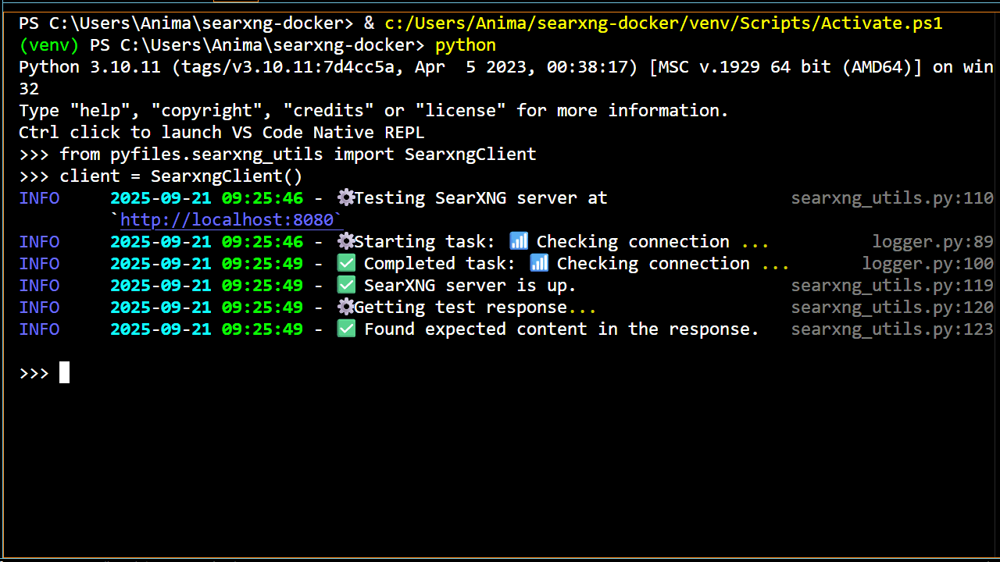

#     SearXNG Docker with LangChain


<p align="center">
  
</p>

## 🔖 About This Project 

> TL;DR
Learn how to use a metasearch engine built on your local machine. Then, you can use this setup as a tool to give to [locally run AI agents][tutorials] 🤖.

This repo demonstrates how to set up a local [SearXNG][searxng] server in [Docker][docker] and get results from the metasearch engine using [LangChain][langchain]. The SearXNG server utilizes a [Caddy][caddy] server for a reverse proxy and a [Valkey][valkey] server (acting through the [Redis][redis] API) for storage. It serves as part of the foundation for building AI agents by giving them the ability to obtain up to date or unfamiliar information. 

The Docker setup of the SearXNG server with Caddy, Valkey, and Redis is heavily based on SearXNG's [searxng-docker repo][searxng-docker]. See the [license section][license-section] for more details.

This project is part of my broader goal to create tutorials and resources for building agents with [LangChain][langchain] and [LangGraph][langgraph]. For more details about how to use this repo and other easily digestible modules to build agents, [check it out here][animakit].

Now, let's get building!

## 🏁 Getting Started 

1.  Make sure [Docker][docker] is installed and running.

1.  Clone the repo, head there, then create a Python environment:

    ```bash
    git clone https://github.com/anima-kit/searxng-docker.git
    cd searxng-docker
    python -m venv venv
    ```

    <a id="gs-activate"></a>

1.  Activate the Python environment:

    ```bash
    venv/Scripts/activate
    ```

1.  Install the necessary Python libraries and create the `.env` file:

    ```bash
    pip install -r requirements.txt
    cp .env.example .env
    ```

1.  Generate a new secret key (see the README instructions of the [searxng-docker][searxng-docker] repo for similar methods):

    <details>
    <summary>Windows</summary>

    ```bash
    $key = python -c "import secrets; print(secrets.token_bytes(32).hex())"
    $content = Get-Content .env
    $content = $content -replace 'SEARXNG_SECRET=.*', "SEARXNG_SECRET=$key"
    Set-Content .env $content
    ```
    </details>

    <details>
    <summary>Linux/macOS</summary>

    ```bash
    SECRET_KEY=$(python3 -c "import secrets; print(secrets.token_bytes(32).hex())")
    sed -i.bak "s/SEARXNG_SECRET=.*/SEARXNG_SECRET=$SECRET_KEY/" .env
    ```
    </details>

    You need to change the secret key from the default `ultrasecretkey` to get the server running properly.

    <a id="gs-start"></a>

1.  Build and start all the Docker containers:

    ```bash
    docker compose up -d
    ```

1.  Head to [http://localhost:8080/][searxng-url] to start searching with a web browser.

1.  Run the test script to ensure the SearXNG server can be reached through the [Requests][requests] and [LangChain][langchain] libraries:

    ```bash
    python searxng_test.py
    ```

    <a id="gs-stop"></a>

1.  When you're done, stop the Docker containers and cleanup with:

    ```bash
    docker compose down
    ```

## 📝 Example Use Cases 

After setting everything up, you can now search the web through the SearXNG metasearch engine, rather it be through a web browser or through the provided Python methods.

The main class to interact with the metasearch engine is the `SearxngClient` class which is built on the [Requests][requests] and [LangChain][langchain] libraries. Once this class is initialized, you can get search results with `run` (get a summary of all the aggregated results) and `results` (get some number of more detailed results).

> You can also get the full HTML output from the Requests library using the `requests_search` method.

For example, to do a web search through a custom script, follow these steps:

1.  Do [step 3][step-activate] and [step 6][step-start] of the `🏁 Getting Started` section to activate the Python environment and run the SearXNG server.

1.  Create a script named `my-web-searx-ex.py` with the following:

    ```python
    # Import SearXNGClient class
    from searxng_utils import SearxngClient

    # Initialize client
    client = SearxngClient()

    # Define number of results and search query
    # Change these variables to get a different number of search results 
    # or to get results for a different search query
    num_results = 3
    query = 'weather My-Location'

    # Get summary response
    client.run(query=query)
    # Get list of more detailed results
    client.results(num_results=num_results, query=query)
    ```

1.  Run the script

    ```bash
    python my-web-searx-ex.py
    ```

1.  When you're done, do [step 9][step-stop] of the `🏁 Getting Started` section to stop the Docker containers and cleanup.

For a more detailed discussion of what can be done with this repo, [check out the companion tutorial here][searxng-tutorial].

## 📚 Next Steps & Learning Resources 

This project is part of a series on building AI agents. For a deeper dive, [check out my tutorials][tutorials]. Topics include:

- Setting up local servers (like this one) to power the agent
- Example agent workflows (simple chatbots to specialized agents)
- Implementing complex RAG techniques
- Discussing various aspects of AI beyond agents

Want to learn how to expand this setup? [Visit my portfolio][animakit] to explore more tutorials and projects!

## 🏯 Project Structure

```
├── Caddyfile               # Caddy reverse proxy configuration
├── docker-compose.yml      # Docker configurations
├── logger.py               # Python logger for tracking progress
├── requirements.txt        # Required Python libraries for main app
├── requirements-dev.txt    # Required Python libraries for development
├── searxng/                # SearXNG configuration directory
│   └── limiter.toml        # Bot protection and rate limiting settings
│   └── settings.yml        # Further custom SearXNG settings
├── searxng_test.py         # Python test of methods
├── searxng_utils.py        # Python methods to use SearXNG server
├── tests/                  # Testing suite
├── third-party/            # searxng-docker licensing
└── .env.example            # Custom SearXNG environment variables
```

## ⚙️ Tech 

- [SearXNG][searxng]: Metasearch engine setup in Docker
- [searxng-docker][searxng-docker]: Base setup of all containers in Docker
- [Caddy][caddy]: Reverse proxy
- [Valkey][valkey] (acting through the [Redis][redis] API): Data storage
- [Requests][requests]: Testing SearXNG server in Python
- [LangChain][langchain]: Using SearXNG server to get search results
- [Docker][docker]: Setup of all containers

## 🔗 Contributing 

This repo is a work in progress. If you'd like to suggest or add improvements, fix bugs or typos etc., feel free to contribute. Check out the [contributing guidelines][contributing] to get started.

<a id="license-section"></a>

## 📑 License

The Docker setup for this repo is heavily based on the [searxng-docker][searxng-docker] repo and is [licensed under AGPL3][license] in accordance with the [original license][searxng-docker-license].


[animakit]: http://anima-kit.github.io/
[caddy]: https://caddyserver.com/
[contributing]: CONTRIBUTING.md
[docker]: https://www.docker.com/
[langchain]: https://www.langchain.com/
[langgraph]: https://www.langchain.com/langgraph/
[license]: LICENSE
[license-section]: https://github.com/anima-kit/searxng-docker/blob/main/README.md#license-section
[python]: https://www.python.org/
[redis]: https://redis.io/
[requests]: https://requests.readthedocs.io/en/latest/
[searxng]: https://docs.searxng.org/
[searxng-docker]: https://github.com/searxng/searxng-docker/tree/master
[searxng-docker-license]: third-party/searxng-docker-LICENSE
[searxng-tutorial]: http://anima-kit.github.io/tutorials/servers/searxng/
[searxng-url]: http://127.0.0.1:8080/
[step-activate]: https://github.com/anima-kit/searxng-docker/blob/main/README.md#gs-activate
[step-start]: https://github.com/anima-kit/searxng-docker/blob/main/README.md#gs-start
[step-stop]: https://github.com/anima-kit/searxng-docker/blob/main/README.md#gs-stop
[tutorials]: https://anima-kit.github.io/tutorials/
[valkey]: https://valkey.io/